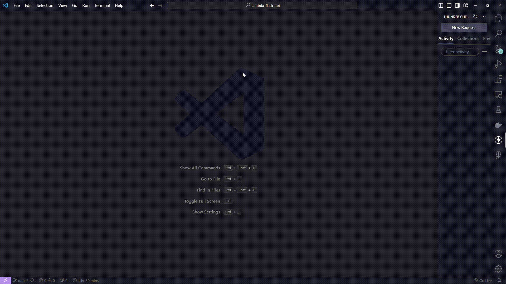

# Lambda com API gateway na AWS em python

## 1. Introdução

Este README explica os principais aspectos do código Python criado e como ele está integrado com a AWS Lambda e a API Gateway. Além disso, fornece instruções sobre como executar os testes e configurar a autenticação.

## 2. AWS Lambda Integrado com a API Gateway

Lambda é um serviço de computação serverless da AWS, que permite a execução de código sem a necessidade de gerenciar servidores. O código Python criado é destinado a ser executado como uma função Lambda e exposto via API Gateway.

## 3. Utilização do Princípio DRY (Don't Repeat Yourself)

No código, o princípio DRY é aplicado para evitar repetição. Isso é feito na função `authenticate_user`, que centraliza a lógica de autenticação, evitando duplicação em outros lugares do código.

## 4. Implementação do Endpoint REST com o API Gateway

O código é configurado para funcionar como um Endpoint REST, permitindo o acesso aos recursos por meio da API Gateway. Os métodos HTTP, como POST, GET, PUT e DELETE, podem ser usados para interagir com a função Lambda.

## 5. Realização de um POST com JSON

Para fazer um POST com JSON para o Endpoint REST criado, você pode usar ferramentas como Thunder Client, Postman ou qualquer outra similar. Certifique-se de incluir o cabeçalho de autenticação 'Authorization' no formato 'Basic user:password'. O corpo da solicitação deve conter o JSON a ser processado pela função Lambda.

## 6. Implementação de Token de Autenticação

O código Python implementa a autenticação básica com base64, onde o cabeçalho 'Authorization' contém as credenciais do usuário no formato 'Basic user:password'. Isso é usado para autenticar os usuários antes de processar a solicitação.

## 7. Execução do Código de testes

Para executar o código de teste no terminal com o Python, siga o seguinte passo a passo:

- **Pré-requisitos**: Certifique-se de que você tem o Python instalado.

1. Abra um terminal.
2. Navegue até o diretório que contém o arquivo `test_lambda.py` fornecido.
3. Execute o código com o comando `python test_lambda.py`.

## 8. Manual de Configuração Passo a Passo

Se você deseja configurar a AWS Lambda e a API Gateway para implantar o código, consulte o manual de configuração passo a passo, ele explicará como criar a função Lambda, configurar a API Gateway e associar o código.

Para acessar o manual de configuração <a href='./Manual_Configuracao.pdf'>clique aqui</a>.

## 9. Configuração de URL e Credenciais

Para executar a aplicação e interagir com o Endpoint REST, você precisará possuir a URL do endpoint e as credenciais de usuário e senha. Siga os passos abaixo para obter esses parâmetros:

### 9.1. URL do Endpoint

A URL do endpoint é o endereço onde a API Gateway expõe a sua função Lambda. Você deve obter esta URL após a configuração da API Gateway. Utilize a url abaixo para utilizar a aplicação:

``` 

URL do Endpoint

https://115amt7vuc.execute-api.us-east-1.amazonaws.com/default/lambda-flask-function

```

### 9.2. Credenciais de Usuário e Senha

Para autenticar com o Endpoint REST, você deve fornecer credenciais de usuário e senha no cabeçalho de autenticação 'Authorization'. Substitua `<USUARIO>` e `<SENHA>` pelos valores de usuário e senha disponibilizados abaixo.

O cabeçalho 'Authorization' deve ser no formato 'Basic user:password', onde 'user' é o nome de usuário e 'password' é a senha. Os logins autorizados são os seguintes:

``` 
user 1 : Giovanna

password 1 : AlunoLambdaFlask
```

``` 
user 2 : Afonso

password 2 : ProfessorLambdaFlask
```


Certifique-se de que as credenciais de usuário e senha sejam corretas e correspondam às configurações no código Python. Após configurar a URL do endpoint e as credenciais de usuário e senha, você estará pronto para interagir com a aplicação e testar as funcionalidades do Endpoint REST.


## 10. Resultados Esperados

Quando a função Lambda é acionada com sucesso e a autenticação é bem-sucedida, a função retornará o JSON fornecido no corpo da solicitação, formatado de maneira legível. Em caso de erros na solicitação ou autenticação, a função responderá com o código de status e uma mensagem de erro correspondente.


<br>



<br>

## 11. Contribuição

Esta atividade foi realizada em conjunto com a colaboração dos seguintes alunos:

- [Lucas Vieira](mailto:Lucas.Vieira@sou.inteli.edu.br)
- [Dayllan Alho](mailto:Dayllan.Alho@sou.inteli.edu.br)
- [Izabella Faria](mailto:Izabella.Faria@sou.inteli.edu.br)
- [Pedro Rezende](mailto:Pedro.Rezende@sou.inteli.edu.br)


